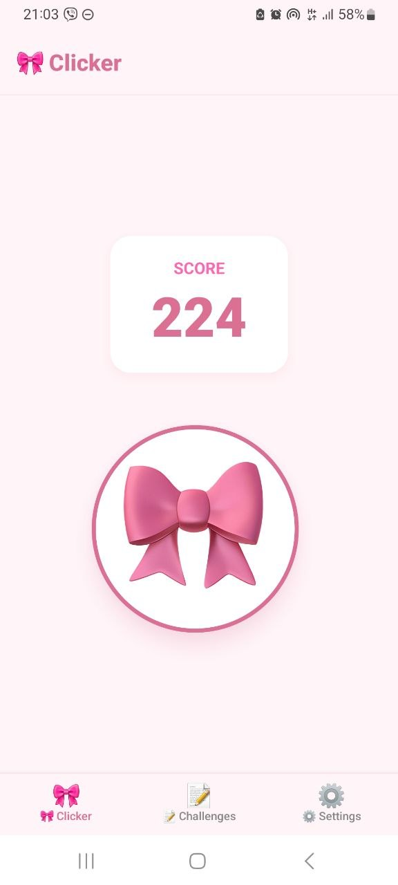
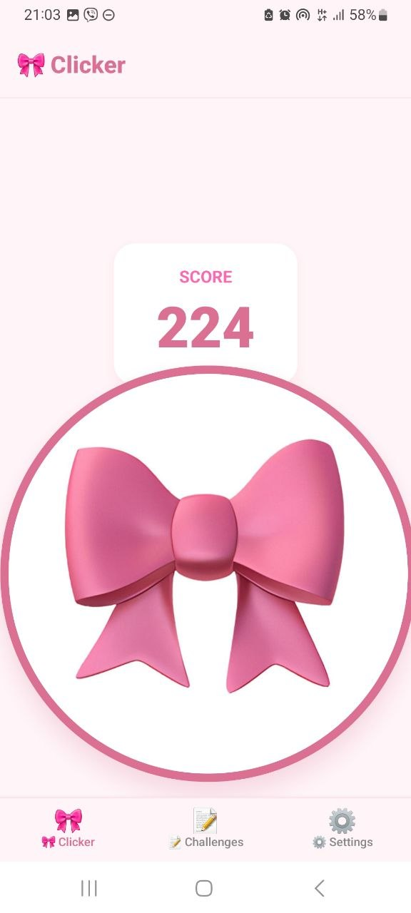
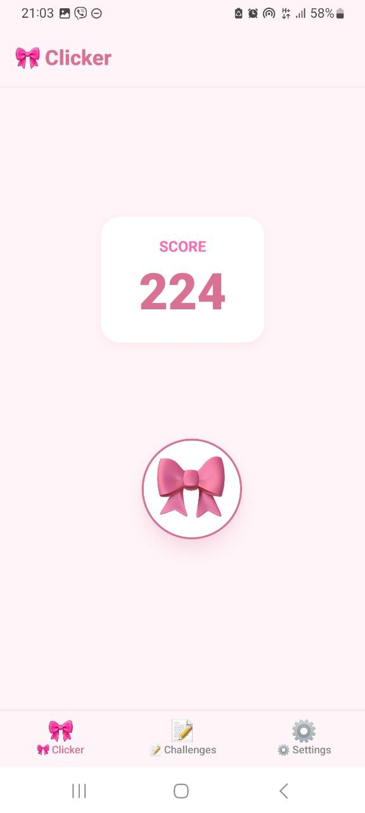
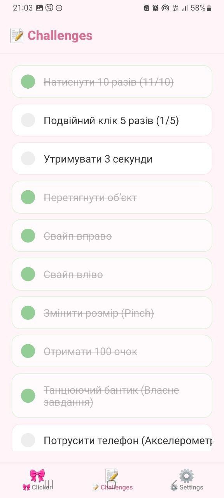
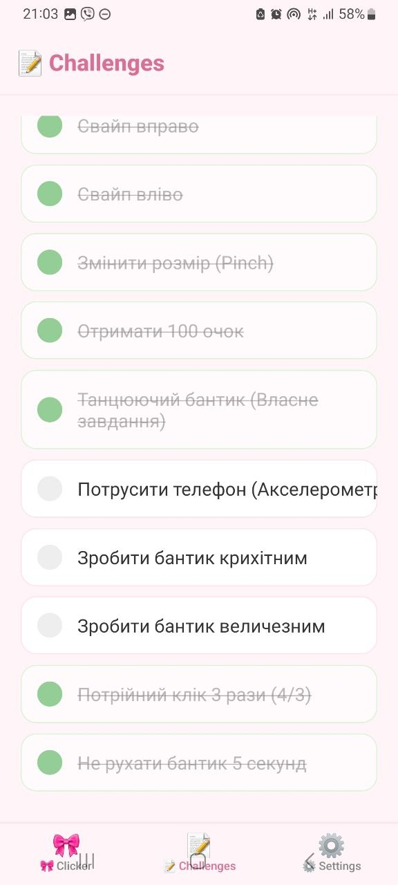
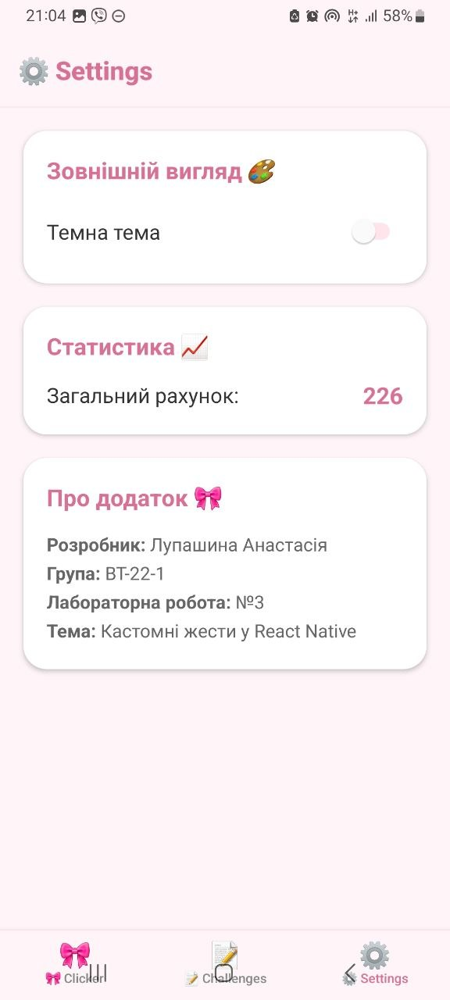
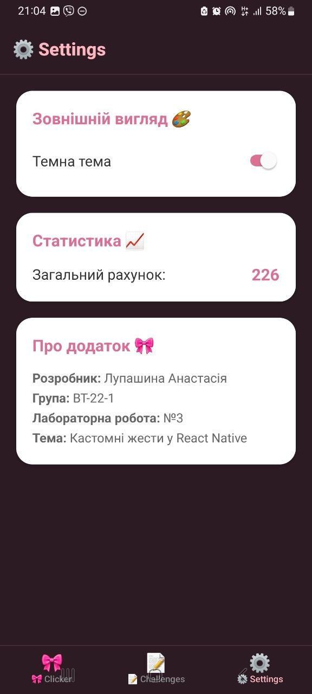

# 🎀 Лабораторна робота №3: Жести та стилізація у React Native

### Розробка інтерактивного ігрового застосунку "Gesture Clicker"

[cite_start]Цей проект присвячений реалізації складних користувацьких взаємодій за допомогою жестів та впровадженню сучасних підходів до стилізації інтерфейсу мобільного застосунку[cite: 124, 125].

-----

## 🎯 Мета роботи

* [cite_start]Навчитися працювати з бібліотекою `react-native-gesture-handler`[cite: 125].
* [cite_start]Реалізувати обробку різних типів жестів: тапи, довгі натискання, перетягування, свайпи та масштабування[cite: 165, 169].
* [cite_start]Застосувати `Styled Components` для створення адаптивного та естетичного інтерфейсу з підтримкою темної/світлої тем[cite: 188].

-----

## 📋 Реалізований функціонал

### 1\. Ігрова механіка (Екран Clicker)

[cite_start]Центральним елементом є інтерактивний об'єкт (рожевий бантик), який реагує на жести та змінює лічильник очок[cite: 161, 163]:

* [cite_start]**Tap (Одинарний клік):** Отримання базових очок[cite: 166].
* [cite_start]**Double Tap (Подвійний клік):** Нарахування подвійної кількості бонусів[cite: 167].
* [cite_start]**Long Press (3 сек):** Спеціальний бонус за витримку[cite: 168, 174].
* [cite_start]**Pan (Drag):** Можливість вільно переміщувати бантик по всьому екрану[cite: 168, 176].
* [cite_start]**Fling (Swipe):** Швидкі свайпи вліво/вправо для отримання рандомних балів[cite: 169, 177, 178].
* [cite_start]**Pinch (Zoom):** Масштабування бантика пальцями для виконання завдань[cite: 169, 179].

### 2\. Система завдань (Екран Challenges)

[cite_start]Реалізовано трекер прогресу, який відстежує виконання 9 специфічних завдань[cite: 170, 180]:

1.  [cite_start]**Натиснути 10 разів**[cite: 172].
2.  [cite_start]**Зробити подвійний клік 5 разів**[cite: 173].
3.  [cite_start]**Утримувати об'єкт 3 секунди**[cite: 175].
4.  [cite_start]**Перетягнути об'єкт по екрану**[cite: 176].
5.  [cite_start]**Свайп вправо**[cite: 177].
6.  [cite_start]**Свайп вліво**[cite: 178].
7.  [cite_start]**Змінити розмір (Pinch)**[cite: 179].
8.  [cite_start]**Набрати 100 очок**[cite: 180].
9.  **Власне завдання:** "Stay Still" (не рухати об'єкт протягом 5 секунд) або "Shake" (потрусити телефон).

### 3\. Навігація та Стилізація

* [cite_start]**Навігація:** Використано `@react-navigation/native` з нижньою панеллю вкладок (Bottom Tabs) для швидкого перемикання між грою, завданнями та налаштуваннями[cite: 184, 185].
* [cite_start]**Дизайн:** Використано **Styled Components**[cite: 188]. Додаток має "Coquette" естетику з м'якими рожевими градієнтами, тінями та закругленими формами.

-----

## 📸 Скріншоти роботи застосунку


На першому скріні продемонстровано головний екран з клікером та рахунок кліків.


На 2 скріні можемо побачити збільшений клікер, це реалізізація одного з челенджів.


На 3 скріні можемо побачити зменшений клікер, це реалізізація одного з челенджів.



На 4 та 5 скрінах кріні можемо побачити самі челенджі, виконані позначаються галочкою.


На 6 скріншоті бачимо налаштування, де можна обрати темну чи світлу тему, побачити статистику та інформацію про додаток.


На 7 скріншоті бачимо зміну зовнішнього вигляду при виборі темної теми.

-----

## 🛠 Технічні деталі

* **Gesture Handling:** Використання `GestureDetector` та `Gesture.Simultaneous/Race` для запобігання конфліктів між перетягуванням та свайпами.
* **Анімації:** Бібліотека `react-native-reanimated` для плавного масштабування та переміщення об'єктів.
* **Датчики:** Інтеграція `expo-sensors` для обробки струшування пристрою (Shake gesture).

-----

## Інструкція з розгортання

1.  **Клонування:**
    ```bash
    git clone https://github.com/Anastasiialup/MobileLabsRN2026/lab3.git
    ```
2.  **Встановлення пакетів:**
    ```bash
    npm install
    ```
3.  **Бібліотеки навігації (важливо):**
    ```bash
    npm install @react-navigation/native @react-navigation/drawer @react-navigation/stack
    ```
4.  **Запуск:**
    ```bash
    npx expo start
    ```

-----

## 📝 Висновки

В результаті виконання роботи було опановано механізми обробки складних жестів у React Native. Навченося поєднувати декілька типів взаємодій на одному об'єкті без конфліктів та реалізовано систему відстеження ігрових досягнень через глобальний стан (Context API). [cite_start]Стилізація за допомогою Styled Components дозволила створити візуально привабливий та зручний інтерфейс[cite: 196].
