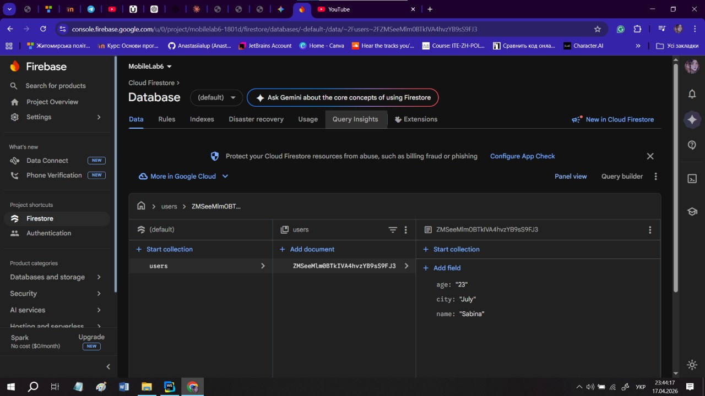
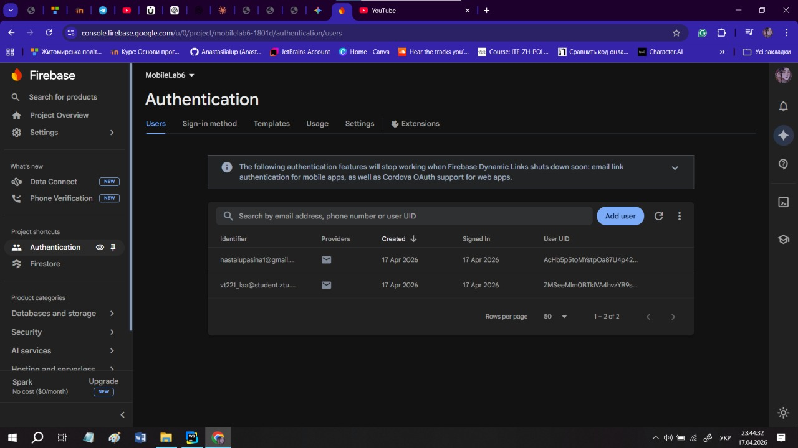

# 🎀 Лабораторна робота №6: Інтеграція Firebase у React Native (Expo)

## Огляд проєкту
Цей додаток реалізує систему автентифікації та керування профілем користувача за допомогою **Firebase Authentication** та **Cloud Firestore**. Навігація побудована на базі **Expo Router** із використанням захищених маршрутів.

## Виконані вимоги (Чек-лист)

### 1. Автентифікація (Firebase Auth API)
- [x] **Реєстрація**: Створення нового облікового запису (Email/Password).
- [x] **Вхід**: Авторизація існуючих користувачів.
- [x] **Відновлення пароля**: Надсилання листа для скидання пароля на електронну пошту (Вимога №5).
- [x] **Вихід**: Завершення сесії користувача.
- [x] **Видалення**: Повне видалення облікового запису користувача (Вимога №4).

### 2. Керування даними (Firestore API)
- [x] **Зберігання даних**: Персональні дані (Ім'я, Вік, Місто) зберігаються у Firestore.
- [x] **CRUD операції**: Реалізовано читання, створення, оновлення та видалення документа користувача.
- [x] **Прив'язка до UID**: Кожен документ у колекції `users` має ID, що відповідає `uid` з Firebase Auth (Вимога №2).

### 3. Захист доступу та Навігація
- [x] **Expo Router Groups**: Розділення на публічну групу `(auth)` та захищену `(app)`.
- [x] **Redirect**: Автоматичне перенаправлення неавторизованих користувачів на екран логіна через `_layout.js`.
- [x] **Firestore Security Rules**: Налаштовані правила доступу на стороні сервера (користувач бачить лише свій документ).
- [x] **AuthContext**: Централізоване керування станом авторизації через React Context API.

## Технологічний стек
* **Framework**: React Native (Expo)
* **Navigation**: Expo Router (File-based)
* **Backend**: Firebase (Auth, Firestore)
* **Storage**: AsyncStorage (для збереження сесії)
* **Language**: JavaScript

## Структура папок
```text
├── app/
│   ├── (app)/               # Захищені маршрути (тільки для авторизованих)
│   │   ├── _layout.js       # Контролер доступу (Redirect)
│   │   └── index.js         # Екран профілю (Firestore CRUD)
│   ├── (auth)/              # Публічні маршрути
│   │   ├── _layout.js       # Навігатор входу/реєстрації
│   │   ├── login.js         # Вхід та скидання пароля
│   │   └── register.js      # Реєстрація користувача
│   └── _layout.js           # Головний файл (обгортка AuthProvider)
├── context/
│   └── AuthContext.js       # Логіка Firebase та стан юзера
└── firebaseConfig.js        # Конфігурація зв'язку з Firebase
```

## Налаштування Firestore Rules
Для забезпечення безпеки даних (Вимога №3) було встановлено наступні правила:
```javascript
service cloud.firestore {
  match /databases/{database}/documents {
    match /users/{userId} {
      allow read, write: if request.auth != null && request.auth.uid == userId;
    }
  }
}
```

-----

## 📸 Скріншоти роботи застосунку


На першому скріні продемонстровано екран з входом в систему, а саме логіном, де потрібно ввести пошту та пароль, або вибрати реєстрацію, якщо акаунт відсутній.
Також є можливість відновити пароль.


На другому скріншоті продемонстрована ситуація коли неправильно введено email або пароль.


На третьому скріншоті показано що робити якщо забули пароль програма відправляє на пошту лист зі скиданням паролю.


На четвертому скріншоті показано мій профіль після успішного входу в аккаунт.


На п'ятому скріншоті показано що буде якщо змінити свої дані і зберегти їх Вони успішно збережені.


На шостому скріншоті показано що відбувається коли користувач намагається видалити акаунт після натискання кнопки видалити акаунт видаляється навіть з бази даних firebase.


На сьомому слайді показано реєстрація користувача коли введено Пошту а паролі не збігаються.


На восьмому скріншоті показано як виглядає профіль після успішної реєстрації користувача.



На восьмому та дев'ятому скріншотах показана робота з firebase, була створена аутентифікація, також додано зміну паролю та оформлену базу даних.

-----

## 📸 Як запустити
1. Встановити залежності:
   ```bash
   npm install
   ```
2. Запустити проєкт:
   ```bash
   npx expo start
   ```

---

## Висновки

У ході лабораторної роботи №6 було успішно реалізовано інтеграцію хмарних сервісів **Firebase** у застосунок на базі **React Native**.

**Основні результати:**
1.  **Автентифікація**: Налаштовано систему реєстрації, входу та відновлення пароля через Email за допомогою **Firebase Auth**.
2.  **Робота з даними**: Реалізовано збереження та редагування профілю користувача (ім'я, вік, місто) у базі даних **Cloud Firestore**.
3.  **Безпека**: Впроваджено захищену навігацію через **Expo Router** (групи `(auth)` та `(app)`) та налаштовано серверні правила доступу (**Firestore Rules**), що дозволяють користувачам працювати лише з власними даними.
4.  **Архітектура**: Використано **React Context API** для централізованого керування станом авторизації в усьому додатку.

**Результат**: Додаток повністю відповідає вимогам безпеки та функціональності, забезпечуючи надійне збереження персональних даних користувачів.
